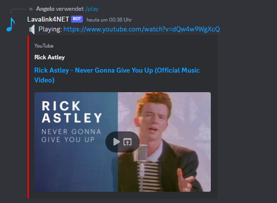

# Playing music

It's now time to play our first notes using Lavalink4NET. In practice, for most users it is easier to manage connection to voice channels and player retrieval using a single method in their commands module.

## Adding music command

Now, you managed to retrieve the player. It is time to play some music. We will create a command that allows the user to play music. The command will take a search query as an argument and search for tracks on YouTube. If tracks are found, the first track will be played.

```csharp title="MyCommands.cs"
[SlashCommand("play", description: "Plays music", runMode: RunMode.Async)]
public async Task Play(string query)
{
    // Defer the response to indicate that the bot is working on the command.
    // Resolving tracks from YouTube may take some time, so we want to let the user
    // know that the bot is working on the command.
    await DeferAsync().ConfigureAwait(false);

    // Retrieve the player using the method we created earlier.
    // We allow to connect to the voice channel if the user is not connected.
    var player = await GetPlayerAsync(connectToVoiceChannel: true).ConfigureAwait(false);

    // If the player is null, something failed. We already sent an error message to the user
    if (player is null)
    {
        return;
    }

    // Load the track from YouTube. This may take some time, so we await the result.
    var track = await _audioService.Tracks
        .LoadTrackAsync(query, TrackSearchMode.YouTube)
        .ConfigureAwait(false);

    // If no track was found, we send an error message to the user.
    if (track is null)
    {
        await FollowupAsync("😖 No results.").ConfigureAwait(false);
        return;
    }

    // Play the track and inform the user about the track that is being played.
    await player.PlayAsync(track).ConfigureAwait(false);
    await FollowupAsync($"🔈 Playing: {track.Uri}").ConfigureAwait(false);
}
```

:::caution
Whenever you use the `GetPlayerAsync` method to retrieve a player and you allow the player to connect to the voice channel, you should specify `runMode: RunMode.Async` on the command. This will allow Lavalink4NET to receive internal events from Discord and update the player accordingly. `RunMode.Async` executes the command asynchronously, so you avoid blocking the bot receiving thread.
:::

:::info
For best practice, you should also defer the response before retrieving the player. This will let the user know that the bot is working on the command. Resolving tracks from YouTube may take some time, so we want to let the user know that the bot is working on the command.
:::

---

Great, we are now able to play music in our bot. If you call the command, the bot will join the voice channel and play the track. If you call the command again, the track will be added to the queue and played after the current track finished.



---

**What's next?**

We now implemented the most basic feature of a music bot: playing music. But there is more to it. In the next section, we will implement a command that allows the user to skip the current track, pause the player, resume the player, and more.

---

:::tip
If you need an overview of the code used in this chapter, you can find the complete source code for the bot [here](https://github.com/angelobreuer/Lavalink4NET/tree/feature/angelobreuer/lavalink-v4/samples/Lavalink4NET.Discord_NET.ExampleBot).
:::
