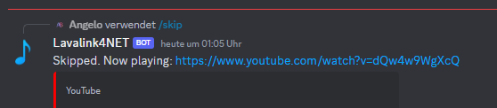

# Skipping tracks

To skip the current track, we can use the `SkipAsync` method. This method will skip the current track and play the next track in the queue.

```csharp
[SlashCommand("skip", description: "Skips the current track", runMode: RunMode.Async)]
public async Task Skip()
{
    var player = await GetPlayerAsync(connectToVoiceChannel: false);

    if (player is null)
    {
        return;
    }

    if (player.CurrentTrack is null)
    {
        await RespondAsync("Nothing playing!").ConfigureAwait(false);
        return;
    }

    await player.SkipAsync().ConfigureAwait(false);

    var track = player.CurrentTrack;

    if (track is not null)
    {
        await RespondAsync($"Skipped. Now playing: {track.Uri}").ConfigureAwait(false);
    }
    else
    {
        await RespondAsync("Skipped. Stopped playing because the queue is now empty.").ConfigureAwait(false);
    }
}
```


