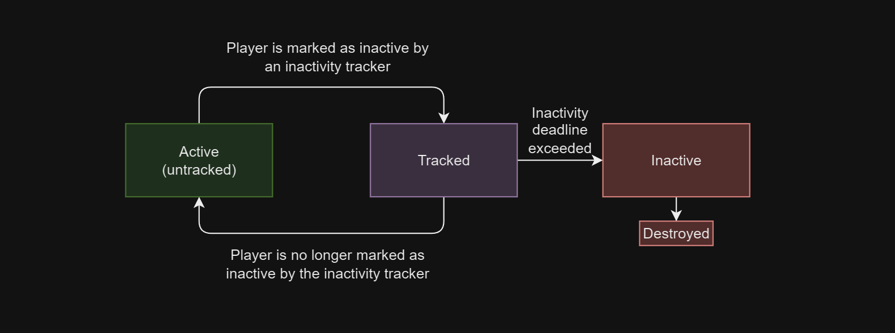

# Introduction

What exactly is inactivity tracking? Inactivity tracking is a feature that allows you to track the activity of a player. This is useful if you want to automatically disconnect the player from the voice channel if the player is inactive for a certain amount of time, or if the all users left the voice channel.

## Concept

- **Active**: The player is active if the player inactivity trackers report that the player is active. If the player is active, the player will not be disconnected from the voice channel.

- **Tracked**: The player is tracked if the inactivity tracking service detects the player as inactive for the first time.

- **Inactive**: The player was previously tracked and the inactivity deadline is reached. The player will be disconnected from the voice channel on the next poll.

The inactivity tracking service will poll, by default every 5 seconds, all players. If an inactivity tracker reports that the player is inactive, the player will be marked as tracked. If the player is inactive for a certain amount of time, the player will be marked as inactive and will be disconnected from the voice channel.
