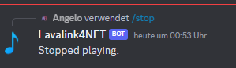

# Controlling the player

Now that we have a player and are able to play music, we need to be able to control the player. In this section we will go through the most common player controls.

:::note
We are currently using the `QueuedLavalinkPlayer` which is a wrapper around the `LavalinkPlayer` that adds a queue to the player. The `QueuedLavalinkPlayer` is a good choice for most bots.
:::

## Stopping the player

To stop the player, we can use the `StopAsync` method. This method will stop the player and clear the queue.

```csharp
[SlashCommand("stop", description: "Stops the current track", runMode: RunMode.Async)]
public async Task Stop()
{
    // Retrieve the player using the method we created earlier.
    // We do not allow to connect to the voice channel if the user is not connected.
    // It would not make sense to connect the player to the voice channel, only to stop it.
    var player = await GetPlayerAsync(connectToVoiceChannel: false);

    if (player is null)
    {
        // We already sent an error message to the user
        return;
    }

    // Check if the player is playing
    if (player.CurrentTrack is null)
    {
        // If the player is not playing, we send an error message to the user
        await RespondAsync("Nothing playing!").ConfigureAwait(false);
        return;
    }

    // Stop the player and send a message to the user
    await player.StopAsync().ConfigureAwait(false);
    await RespondAsync("Stopped playing.").ConfigureAwait(false);
}
```



:::info
Later when you got to know Lavalink4NET better, you would use player preconditions to determine the player state. For now, we will use the `CurrentTrack` property to check if the player is playing.
:::

---

## Controlling volume

To control the volume of the player, we can use the `SetVolumeAsync` method. This method takes a volume value between 0 and 1000. The default volume is 100.

```csharp
[SlashCommand("volume", description: "Sets the player volume (0 - 1000%)", runMode: RunMode.Async)]
public async Task Volume(int volume = 100)
{
    if (volume is > 1000 or < 0)
    {
        await RespondAsync("Volume out of range: 0% - 1000%!").ConfigureAwait(false);
        return;
    }

    var player = await GetPlayerAsync(connectToVoiceChannel: false).ConfigureAwait(false);

    if (player is null)
    {
        return;
    }

    await player.SetVolumeAsync(volume / 100f).ConfigureAwait(false);
    await RespondAsync($"Volume updated: {volume}%").ConfigureAwait(false);
}
```


:::info
The `SetVolumeAsync` method takes a float value between 0 and 1. We divide the volume by 100 to convert it to a float value between 0 and 10. Most users prefer to use a volume value from 0 to 100, so we convert it to a percentage value.
:::

:::note
Note that values above 100% may cause distortion.
:::

---

## Showing player position

To show the current player position, we can use the `CurrentPosition` property. This property returns a `TimeSpan` value that represents the current position of the player.

```csharp
[SlashCommand("position", description: "Shows the track position", runMode: RunMode.Async)]
public async Task Position()
{
    var player = await GetPlayerAsync(connectToVoiceChannel: false).ConfigureAwait(false);

    if (player is null)
    {
        return;
    }

    if (player.CurrentTrack is null)
    {
        await RespondAsync("Nothing playing!").ConfigureAwait(false);
        return;
    }

    await RespondAsync($"Position: {player.Position?.Position} / {player.CurrentTrack.Duration}.").ConfigureAwait(false);
}
```

:::info
The `player.Position` property returns a `TrackPosition` structure which contains a lot of information about the current position. We use the `Position` property of the `TrackPosition` structure to get the current position as a `TimeSpan` value.
:::


:::note
The `CurrentPosition` property is not updated in real-time. It is updated every 5 seconds by the lavalink server and is interpolated between updates. This means that the position may be slightly off.
:::

---

## Skipping the track

To skip the current track, we can use the `SkipAsync` method. This method will skip the current track and play the next track in the queue.

```csharp
[SlashCommand("skip", description: "Skips the current track", runMode: RunMode.Async)]
public async Task Skip()
{
    var player = await GetPlayerAsync(connectToVoiceChannel: false);

    if (player is null)
    {
        return;
    }

    if (player.CurrentTrack is null)
    {
        await RespondAsync("Nothing playing!").ConfigureAwait(false);
        return;
    }

    await player.SkipAsync().ConfigureAwait(false);

    var track = player.CurrentTrack;

    if (track is not null)
    {
        await RespondAsync($"Skipped. Now playing: {track.Uri}").ConfigureAwait(false);
    }
    else
    {
        await RespondAsync("Skipped. Stopped playing because the queue is now empty.").ConfigureAwait(false);
    }
}
```


## Pausing the player

To pause the player, we can use the `PauseAsync` method. This method will pause the player and keep the current position.

```csharp
[SlashCommand("pause", description: "Pauses the player.", runMode: RunMode.Async)]
public async Task PauseAsync()
{
    var player = await GetPlayerAsync(connectToVoiceChannel: false);

    if (player is null)
    {
        return;
    }

    if (player.State is  PlayerState.Paused)
    {
        await RespondAsync("Player is already paused.").ConfigureAwait(false);
        return;
    }

    await player.PauseAsync().ConfigureAwait(false);
    await RespondAsync("Paused.").ConfigureAwait(false);
}
```


---

## Resuming the player

To resume the player, we can use the `ResumeAsync` method. This method will resume the player.

```csharp
[SlashCommand("resume", description: "Resumes the player.", runMode: RunMode.Async)]
public async Task ResumeAsync()
{
    var player = await GetPlayerAsync(connectToVoiceChannel: false);

    if (player is null)
    {
        return;
    }

    if (player.State is not PlayerState.Paused)
    {
        await RespondAsync("Player is not paused.").ConfigureAwait(false);
        return;
    }

    await player.ResumeAsync().ConfigureAwait(false);
    await RespondAsync("Resumed.").ConfigureAwait(false);
}
```


---